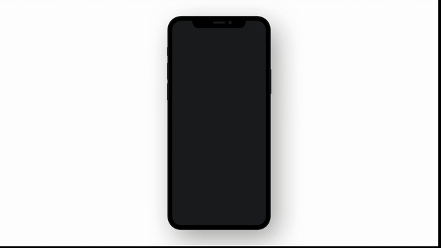
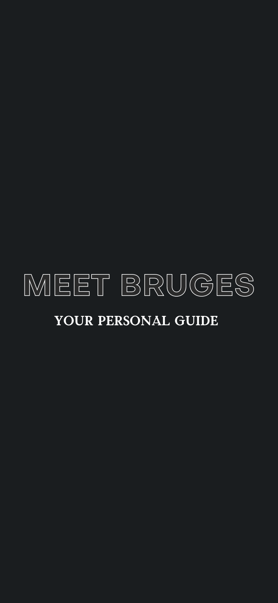
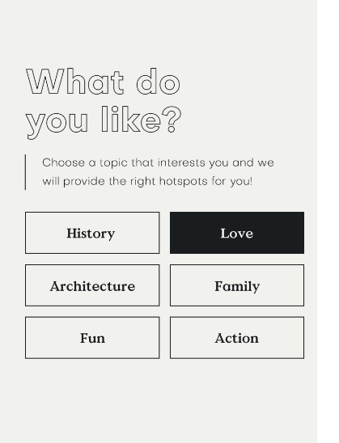
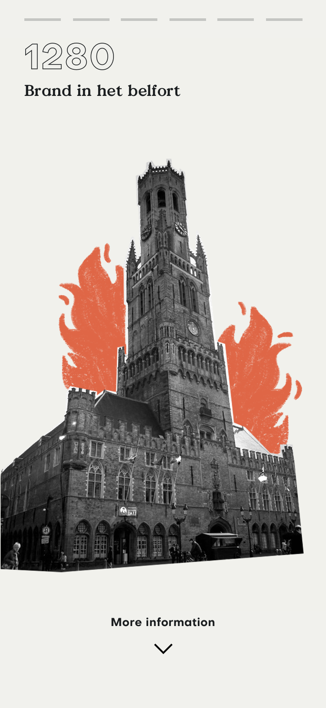

# Cityhacks - Cultural Lab

We participated in a hackaton called Cityhacks where the goal was to come up with and develop an innovative concept where open data is used and that can be culturally useful for the city Bruges.  

We developed a prototype of a mobile application where the user can see all the cultural heritage on a map based on his/her cultural preference. When clicking on a landmark, a timeline of all its important, historical events appears where the user, by swiping left or right, goes further or back in the timeline or can see more information about that event by swiping down.

In this way, we can ensure that tourists get a lot of information about Bruges' cultural heritage in a very accessible and fast way, but also that the most popular locations among tourists are mapped out.

## Open Data Sources
Currently we get all of the data with multiple endpoints from [onroerenderfgoed.be](https://www.onroerenderfgoed.be/)

## Preview

## Collaborators

- Jasper Baes (jasper.baes@student.howest.be)
- Léon van Derhaeghen (leon.van.derhaeghen@student.howest.be)
- Rafael De Smet (rafael.de.smet@student.howest.be)
- Marie Devos (coach)
